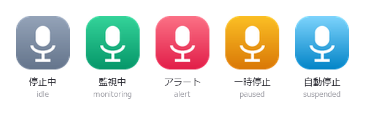
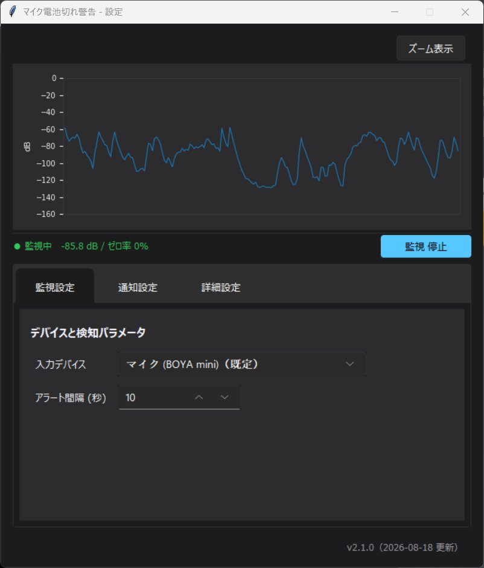

# wireless-mic-battery-alert

[日本語](./README.md) · [English](./README.en.md) · [한국어](./README.ko.md) · [简体中文](./README.zh.md) · [Français](./README.fr.md)

一款 Windows 应用程序，通过接收机的信号中断来检测无线麦克风的电量耗尽和连接异常，并通知用户。

## 概述

- 监控无线麦克风接收机，发射机信号中断时发出警告
- 可设置提示音、暂停提示音、停止监控提示音和恢复监控提示音
- 常驻运行时不会妨碍 Windows 进入睡眠
- 支持 日本語、English、한국어、简体中文、Français
- 以 Windows `.exe` 形式分发为前提

## 检测方式

发射机断电后，接收机会输出**完全的数字静音**（数值严格为 0 的采样）。而只要发射机还在工作，就不会出现零采样。本应用正是利用这一差异来判断。

实测数据（BOYA mini / 经由 WASAPI / 每种状态 10 秒）：

| 状态 | 零采样比例 | 非零最小值 |
|---|---|---|
| 发射机开启 | 0.0000%（480,000 个采样中 0 个） | 2.9e-14 |
| 发射机关闭 | 100.00% | 不存在 |

由于不依赖音量大小，无需调整阈值，也不受环境安静程度的影响。

### 为什么不使用音量阈值

在启用了 Windows 11 **Voice Clarity**（插入采集链路的 AI 降噪 APO）的环境中，背景噪声被强力抑制，**即便发射机正常工作，安静房间里的读数也会低于 -100 dB**。"电量耗尽时的噪声"与"电量正常时的环境音"之间的差异消失，因此无论把阈值设在哪里都无法区分两者。基于信号中断的判断不受此影响。

## 不妨碍睡眠的机制

麦克风保持打开时，USB 音频驱动会持续向 Windows 提出 SYSTEM 电源请求，使电脑无法进入睡眠。应用程序无法撤销该请求，唯一的办法是**关闭数据流本身**。

本应用在电脑持续空闲时会自动停止监控并关闭数据流，恢复操作后自动重新打开。因为"不碰电脑 ＝ 也不会使用无线麦克风"，实际使用中并无损失。

- 自动停止和自动恢复不播放提示音（以便与手动停止、恢复区分）
- 手动停止监控后，即使恢复操作也不会自动重新启动
- 其他应用（Discord、OBS 等）使用麦克风期间会继续监控。因为那段时间该应用本身就在提出电源请求，即使本应用关闭数据流也无法进入睡眠

判定为空闲的时间，请设置为短于所用环境的 Windows 睡眠设置（默认 180 秒）。

需要注意的是，妨碍睡眠的因素不只有本应用。正在播放视频的浏览器、正在发声的其他应用同样会提出电源请求。若系统无法进入睡眠，可以用管理员权限执行 `powercfg /requests`，查看是哪个设备或进程提出了请求。

## 主要功能

- 输入设备选择（WASAPI）
- 基于信号中断的电量耗尽检测
- 警告间隔设置
- 更换提示音（5 种内置音效 / 任意 WAV 文件）
- 暂停提示音、停止监控提示音、恢复监控提示音的设置
- 警告后自动暂停监控，信号恢复后自动继续
- 与电脑空闲状态联动的自动停止与恢复（避免妨碍睡眠）
- 当前输入电平（dB / 静音率）实时显示
- 任务栏托盘常驻（以颜色表示状态的图标，配置文件和日志的入口）
- 界面语言切换（日本語 / English / 한국어 / 简体中文 / Français）
- 浅色 / 深色主题（跟随 Windows 设置）
- Windows 用 EXE 构建

## 任务栏托盘

常驻期间，托盘图标以颜色表示当前状态。



| 图标 | 状态 | 含义 |
|---|---|---|
| 灰色 | 已停止 | 手动停止监控的状态。即使恢复操作也不会自动重新启动 |
| 绿色 | 监控中 | 正常的监控状态 |
| 红色 | 警告 | 检测到信号中断并发出通知后（持续 5 秒） |
| 橙色 | 已暂停 | 警告后的自动暂停。麦克风保持打开，信号恢复后自动继续 |
| 浅蓝 | 自动停止 | 因电脑空闲而关闭麦克风的状态。恢复操作后自动返回 |

**橙色与浅蓝的区别**很重要。橙色（暂停）只是停止发出警告，麦克风仍然打开；浅蓝（自动停止）会关闭麦克风。能让系统进入睡眠的是浅蓝状态。

通过右键菜单可以打开设置窗口、开始/停止监控、打开配置文件位置、打开日志以及退出。

## 设置项

| 项目 | 说明 |
|---|---|
| 输入设备 | 要监控的无线麦克风接收机。设备编号会在重新枚举时改变，因此配置中保存的是名称 |
| 警告间隔（秒） | 信号持续中断期间重复警告的间隔 |
| 总音量 | 提示音的音量（0～100） |
| 提示音 | 检测到电量耗尽时播放的声音 |
| 暂停提示音 | 自动暂停时播放的声音 |
| 停止监控 / 恢复监控提示音 | 手动切换监控时播放的声音 |
| 自动暂停 | 发出指定次数的警告后暂停监控 |
| 暂停前的警告次数 | 默认 1 次 |
| 空闲时自动停止 | 电脑持续空闲时停止监控（默认启用） |
| 判定为空闲的时间（秒） | 默认 180 秒（30～1800） |
| 其他应用使用时继续 | 其他应用使用麦克风时继续监控（默认启用） |
| 主题 | 跟随系统 / 浅色 / 深色 |
| 语言 | 日本語 / English / 한국어 / 简体中文 / Français |

语言在选择的瞬间即刻反映到界面上，无需重启。首次启动时会根据 Windows 区域设置推测，若没有对应的翻译则使用英语。

设置更改后会自动保存。窗口下方会显示保存时间和版本号。

配置文件 `config.json` 保存在与可执行文件相同的位置。可通过托盘右键菜单的"打开配置文件位置"访问。

若找不到已设置的接收机，会自动切换到 WASAPI 默认设备。即使从睡眠恢复或重新插拔 USB 导致设备编号改变，也能继续监控。

信号中断和恢复的判定各有 1 秒的缓冲，因此无线的瞬间中断或刚通电时正在建立连接的过程不会引起误报。该值不是设置项，而是内部常量。

## 日志

运行记录输出到与可执行文件相同位置的 `logs/app.log`。可通过托盘右键菜单的"打开日志"访问。

只在状态发生变化时记录：启动与退出、监控的开始与停止（含手动还是空闲联动的区分）、输入设备的解析结果、警告、自动暂停及其解除，以及各类失败。

由于是常驻应用，通过以下三点抑制日志过度增长。

| 措施 | 内容 |
|---|---|
| 大小上限 | 512KB × 3 代，合计不超过 1.5MB |
| 重复折叠 | 与前一条相同的内容会被丢弃，仅在下一行附上次数 |
| 默认为 INFO | 不会每次轮询都写入 |

需要详细日志时，请将 `config.json` 中的 `debug_log` 设为 `true`。这会使每次轮询都产生记录，因此不建议长期开启。

## 目录结构

```text
wireless-mic-battery-alert/
├── CHANGELOG.md
├── requirements.md
├── wireless-mic-battery-alert-PL/
│   ├── design/
│   └── tasks/
└── wireless-mic-battery-alert-eng/
    ├── assets/
    ├── main.py
    ├── gui.py
    ├── i18n.py
    ├── theme.py
    ├── monitor.py
    ├── notifier.py
    ├── settings.py
    ├── activity.py
    ├── applog.py
    ├── tray.py
    ├── version.py
    ├── test_phase10.py
    ├── test_suspend_flow.py
    ├── test_gui_build.py
    ├── test_resume_no_alert.py
    ├── test_device_resolve.py
    ├── test_logging.py
    ├── test_i18n.py
    ├── build.spec
    ├── build_windows.bat
    └── BUILD_WINDOWS.md
```

| 文件 | 作用 |
|---|---|
| `main.py` | 启动、读取配置、监控控制、通知联动、GUI/托盘联动 |
| `monitor.py` | 输入设备监控、信号中断判定 |
| `activity.py` | 获取电脑空闲时间和其他应用的麦克风使用情况 |
| `applog.py` | 日志输出与大小上限管理 |
| `notifier.py` | 提示音的解析与播放 |
| `settings.py` | 配置文件的读取与保存 |
| `gui.py` | 设置窗口 |
| `i18n.py` | 界面文字的翻译目录与语言切换 |
| `theme.py` | 配色与字体的统一管理 |
| `tray.py` | 任务栏托盘常驻 |
| `version.py` | 版本信息 |

## 开发环境

- Python
- tkinter / ttk / sv_ttk
- sounddevice
- numpy
- matplotlib
- pygame
- pystray
- Pillow
- PyInstaller

安装依赖包：

```bash
pip install -r wireless-mic-battery-alert-eng/requirements.txt
```

## 运行方法

在开发环境中运行：

```bash
cd wireless-mic-battery-alert-eng
python main.py
```

## 测试

```bash
cd wireless-mic-battery-alert-eng
python test_phase10.py
python test_suspend_flow.py
python test_gui_build.py
python test_resume_no_alert.py
python test_device_resolve.py
python test_logging.py
python test_i18n.py
```

检查空闲判定、麦克风使用情况的获取、监控的自动停止与恢复、设置窗口的构建，以及翻译目录的一致性和五种语言下的界面构建。请在 Windows 环境中执行。

## 截图



## Windows 构建

以在 Windows 原生环境中构建为前提。  
在 Linux / WSL 上生成的产物不作为最终分发物。

详情：

- [wireless-mic-battery-alert-eng/BUILD_WINDOWS.md](./wireless-mic-battery-alert-eng/BUILD_WINDOWS.md)

Windows 下的基本命令：

```bat
cd wireless-mic-battery-alert-eng
build_windows.bat
```

## 补充

- `wireless-mic-battery-alert-PL/` 包含设计、进度管理和评审用文档
- `wireless-mic-battery-alert-eng/` 包含实现本体
- `requirements-lock.txt` 用于记录构建环境
- 变更历史请参阅 [CHANGELOG.md](./CHANGELOG.md)
